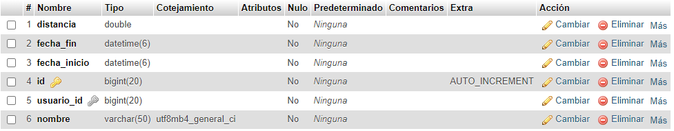
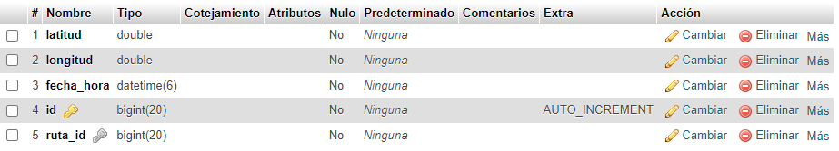

## Nombre del proyecto: Routes Tracker

## Idea del proyecto

Este proyecto consiste en la creación de una **API REST** segura, desarrollada con **Spring Boot** y usando **Spring Security**.
La idea principal es una App que permite almacenar y registrar el seguimiento GPS de un vehículo usando la ubicación en tiempo real de un dispositivo móvil.

## Justificación del proyecto
Esta App nace para cubrir la necesidad de poder registrar tus salidas, rutas o viajes en vehículo, permitiendo consultarlas y compartirlas en cualquier momento. La idea principal es no tener la preocupación de encontrar o localizar de nuevo algún lugar o carretera por la cual has conducido, además de obtener un análisis de cada una de las rutas, un análisis general semanal, mensual etc.
Pensada principalmente para el público motero, que sale a hacer rutas a la aventura sin un destino concreto y quieren tener un registro de esta.


## Descripción de las tablas

### Tabla usuarios


```kotlin
import jakarta.persistence.*

@Entity
@Table(name = "usuarios")
data class Usuario(
    @Id
    @GeneratedValue(strategy = GenerationType.IDENTITY)
    var id: Long? = null,

    @Column(nullable = false, unique = true, length = 40)
    var email: String? = null,

    @Column(nullable = false, length = 150)
    var password: String? = null,

    @Column(nullable = false, length = 40)
    var username: String? = null,

    var roles: String? = null, // e.j., "ROLE_USER,ROLE_ADMIN"

    @OneToMany(mappedBy = "usuario" ,cascade = [(CascadeType.ALL)], orphanRemoval = true)
    var rutas: MutableList<Ruta> = mutableListOf(),
)
```

Esta tabla contendrá los datos del usuario baásicos de autenticación.

### Tabla rutas


```kotlin
import com.fasterxml.jackson.annotation.JsonIgnore
import jakarta.persistence.*
import java.time.LocalDateTime

@Entity
@Table(name = "rutas")
data class Ruta(

    @Id
    @GeneratedValue(strategy = GenerationType.IDENTITY)
    var id: Long? = null,

    @ManyToOne
    @JoinColumn(name = "usuario_id", nullable = false)
    @JsonIgnore
    var usuario: Usuario? = null,

    @OneToMany(mappedBy = "ruta", cascade = [(CascadeType.ALL)], orphanRemoval = true)
    var puntos: List<PuntosGPS>? = null,

    @Column(nullable = false, length = 50)
    var nombre: String? = null,

    @Column(nullable = false, length = 50)
    var fechaInicio: LocalDateTime? = null,

    @Column(nullable = false)
    var fechaFin: LocalDateTime? = null,

    @Column(nullable = false, length = 10)
    var distancia: Double? = null, // ¿?
)
```

Esta tabla contiene la información de cada ruta esencial, como el nombre de la ruta, fechas, distancia. Además, esta relacionada con la tabla Usuarios, almacenando la id del usuario al que pertenece cada ruta.
El campo usuario le pongo @JsonIgnore para que a la hora de relizar la petición no se muestre en bucle.

### Tabla puntos_gps


```kotlin
import jakarta.persistence.*
import java.time.LocalDateTime

@Entity
@Table(name = "puntos_gps")
data class PuntosGPS(

    @Id
    @GeneratedValue(strategy = GenerationType.IDENTITY)
    var id: Long? = null,

    @ManyToOne
    @JoinColumn(name = "ruta_id", nullable = false)
    var ruta: Ruta? = null,

    @Column(nullable = false, length = 20)
    var latitud: Double? = null,

    @Column(nullable = false, length = 20)
    var longitud: Double? = null,

    @Column(nullable = false, length = 15)
    var fechaHora: LocalDateTime = LocalDateTime.now(),
)
```

Esta tabla contiene la información de cada punto que se obtiene del GPS del dispositivo. Está relacionada con la tabla Rutas, para asignarle la ID de la ruta a la que pertenece cada punto.

## Diagrama E-R


## Endpoints
### Tabla usuarios
| Método | Endpoint           | Descripción                |
|--------|--------------------|----------------------------|
| POST   | /usuarios/register | Registrar nuevo usuario    |
| POST   | /usuarios/login    | Hacer login con el usuario |
| GET    | /usuarios/         | Obtener todos los usuarios |
| GET    | /usuario/{id}      | Obtener usuario por ID     |
| PUT    | /usuarios/{id}     | Actualizar usuario por ID  |
| DELETE | /usuarios/{id}     | Eliminar usuario por ID    |

### Tabla rutas
| Método | Endpoint    | Descripción             |
|--------|-------------|-------------------------|
| POST   | /rutas/     | Registrar nueva ruta    |
| GET    | /rutas/     | Obtener todas las rutas |
| GET    | /rutas/{id} | Obtener ruta por ID     |
| PUT    | /rutas/{id} | Actualizar ruta por ID  |
| DELETE | /rutas/{id} | Eliminar ruta por ID    |

### Tabla puntos_gps
| Método | Endpoint              | Descripción                                    |
|--------|-----------------------|------------------------------------------------|
| POST   | /puntos_gps/{rutaId}  | Registra y añade un nuevo punto GPS a una ruta |
| GET    | /puntos_gps/{rutaId}  | Obtiene todos los puntos GPS de una ruta       |
| PUT    | /puntos_gps/{puntoId} | Actualiza un punto GPS por su ID               |
| DELETE | /puntos_gps/{puntoId} | Elimina un punto GPS por su ID                 |


## Explicación Endpoints

### Tabla usuarios
- POST /usuarios -> Resgistra un nuevo usuario proporcionando un correo, contraseña y nombre de usuario. Responde con error si el usuario ya existe.
- GET /usuarios -> Obtiene un listado de la información de todos los usuarios.
- GET /usuarios/{id} -> Obtiene la información de un usuario por su ID. Solo puede acceder si el rol es **ADMIN** o el propio usuario.
- PUT /usuarios/{id} -> Actualiza la información de un usuario
- DELETE /usuarios/{id} -> Borra un usuario a través de su ID y todas sus rutas asociadas. Responde con error si el usuario no existe.

### Tabla rutas
- POST /rutas -> Registra una nueva ruta asociada al usuario autenticado. ...
- GET /rutas -> Obtiene un listado de todas las rutas creadas por un usuario mediante su ID.
- GET /rutas/{id} -> Obtiene los detalles de una ruta específica mediante su ID.
- PUT /rutas/{id} -> Permite actualizar la información de una ruta, como el nombre
- DELETE /rutas/{id} -> Elimina una ruta mediante su ID, del usuario autenticado.


### Tabla puntos_gps
- POST /puntos_gps/{rutaId} -> Permite crear un nuevo punto GPS, que es pasado en el cuerpo de la petición, y lo añade a la Id de la ruta que se le pasa en la petición.
- GET /puntos_gps/{rutaId} -> Obtiene todos los puntos asociados a una ruta específica por su ID. 
- PUT /puntos_gps/{puntoId} -> Actualiza un punto GPS mediante su ID. Se pasa el nuevo punto en el cuerpo de la petición.
- DELETE /puntos_gps/{puntoId} -> Elimina un punto GPS mediante su ID.


## Lógica de Negocio de la API

La lógica de negocio de esta APP, está diseñada para gestionar rutas y puntos GPS asociados a estas rutas, asegurando que los usuarios puedan registrar, acceder, modificar y eliminar rutas y puntos GPS de manera segura y eficiente. También se implementa una serie de reglas de acceso y validaciones que permiten asegurar que los usuarios solo puedan realizar operaciones sobre los recursos que les pertenecen o tienen permisos para gestionar.

Aspectos clave de la lógica de negocio:

*** Todos estos métodos pueden ser usados por el propio usuario, o por un administrador que siempre tiene acceso a todas las funciones ***
### Gestión de usuarios:

#### <u>Creación de usuarios </u>

Un nuevo usuario puede registrarse en el sistema. Comprobaciones: 

- Se comprueba que los campos no estén vacíos (nombre de usuario, email y contraseña).
- Se valida que la contraseña tenga al menos 8 caracteres.
- Se verifica que el nombre de usuario y el email no existan previamente en la base de datos. Si ya existen, se lanza una excepción AlreadyExistsException.
Se codifica la contraseña antes de guardarla en la base de datos para garantizar la seguridad.

#### <u>Autenticación de usuarios </u>
El sistema utiliza Spring Security para manejar la autenticación. El método loadUserByUsername permite que Spring Security obtenga los detalles de un usuario por su nombre de usuario para realizar el login.
Se busca al usuario en la base de datos usando el nombre de usuario y se devuelve un UserDetails con los datos del usuario (como nombre de usuario, contraseña y roles).


#### <u>Obtener todos los usuarios </u>
El método getAllUsers permite recuperar todos los usuarios registrados en el sistema. Este endpoint está restringido solo a administradores, ya que proporciona acceso a la lista completa de usuarios.


#### <u>Obtener usuario por ID </u>
Un usuario pueden ver su información.

Si el usuario autenticado es el mismo que el que se quiere obtener (o ADMIN), se permite la operación.


#### <u>Actualizar usuario </u>
Un usuario puede actualizar su información.

Se valida que los datos proporcionados para la actualización sean válidos y no generen poblemas (por ejemplo, nombre de usuario o email ya registrados o contraseña no cumple con la longitud requerida).
Si el usuario autenticado intenta actualizar su propia información o si es un administrador, la operación se permite.

#### <u>Eliminar usuario </u>
Un usuario puede eliminar su cuenta.

Solo se permite si el usuario autenticado es el mismo que el usuario que se va a eliminar, o si el usuario autenticado tiene rol de administrador.


### Gestión de rutas:


#### <u>Creación de rutas </u>
Un usuario puede crear nuevas rutas.

Cada ruta debe tener un nombre único para evitar conflictos.
Primero se valida que el nombre de la ruta sea valido, se comprueba si existe, y se inserta en la base de datos, asociandola a el usuario concreto.


#### <u>Obtención de rutas </u>
Un usuario puede acceder únicamente a las rutas que le pertenecen.

Primero se valida que el usuario autenticado tenga acceso a la ruta solicitada. Si es así, se le devuelve la ruta, si no,  se lanza una excepción **ForbiddenException**


#### <u>Actualización de rutas </u>
Un usuario pueden actualizar las rutas que le pertenece.

Primero se hacen las validaciones básicas, como comprobar nombre de la ruta que no esté vacio ni ya exista. Luego se actualiza con el nuevo nombre, ya que ess lo único que se permite actualizar, y se guarda en la base de datos.


#### <u>Eliminación de rutas </u>
Un usuario solo puede eliminar rutas que le pertenecen.

Se verifica que la ruta que el usuario quiera eliminar le pertenezca. Si es así, se elimina de la base de datos.


### Gestión de puntos GPS:

#### <u>Creación de puntos </u>
Un punto GPS debe ser asociado a una ruta específica, la cual debe pertenecer al usuario que lo crea.

Primero,el usuario proporciona la ID de la ruta a la que desea agregar el punto GPS. El ssitema valida que esta ruta exista y que sea de el propio usuario. Si es así, se crea el punto GPS, se asocia a dicha ruta, y se guarda en la base de datos.


#### <u>Obtención de puntos </u>
Un usuario solo puede obtener los puntos GPS de las rutas que le pertenecen.

Se verifica que la ruta solicitada pertenezca al usuario autenticado. Si es válida, se devuelve la lista de puntos GPS que estén asociados a dicha ruta.


#### <u>Actualización de puntos </u>
Un usuario puede actualizar los puntos GPS de las rutas que le pertenecen.

Primero el usuario proporciona el ID del punto GPS que desea actualizar. Luego se verifica que el punto GPS pertenece a una ruta del usuario. Si esto se cumple, se actualizan los campos del punto GPS con la nueva información proporcionada.


#### <u>Eliminación de puntos </u>

Un usuario solo puede eliminar puntos GPS de las rutas que le pertenecen.

El usuario proporciona el ID del punto GPS que desea eliminar. Se verifica que el punto GPS pertenece a una ruta del usuario que hace la petición. Si la ruta es válida y el punto GPS pertenece a esa ruta, el punto GPS se elimina de la base de datos.


## Excepciones y códigos de estado


|        Excepción       | Codigo estado HTTP |                                                                                       Descripción                                                                                       |                                                   Mensaje                                                  |
|:----------------------:|:------------------:|:---------------------------------------------------------------------------------------------------------------------------------------------------------------------------------------:|:----------------------------------------------------------------------------------------------------------:|
|   BadRequestException  |         400        |                Se lanza cuando la solicitud realizada por el cliente es incorrecta o no válida, como cuando faltan parámetros obligatorios en el cuerpo de la solicitud.                |                       Bad request exception (400). + El mensaje concreto de cada caso                      |
|    NotFoundException   |         404        |                              Se lanza cuando no se encuentra un recurso solicitado, como cuando se intenta acceder a una ruta o un punto GPS que no existe.                             |                        Not Found Exception (404).+ El mensaje concreto de cada caso                        |
|    ConflictException   |         409        | Se lanza cuando se intenta crear o modificar un recurso que entra en conflicto con un recurso ya existente, como cuando se intenta registrar una ruta con un nombre que ya está en uso. |                        Conflict Exception (409). + El mensaje concreto de cada caso                        |
| AlreadyExistsException |         409        | Se lanza cuando se intenta crear o modificar un recurso que entra en conflicto con un recurso ya existente, como cuando se intenta registrar una ruta con un nombre que ya está en uso. |                        Conflict Exception (409). + El mensaje concreto de cada caso                        |
|  UnauthorizedException |         401        |                                   Se lanza cuando el usuario no está autenticado o no ha proporcionado credenciales válidas para acceder a un recurso.                                  |                      Unauthorized Exception (401). + El mensaje concreto de cada caso                      |
|   ForbiddenException   |         403        |                                     Se lanza cuando el usuario no tiene permisos suficientes para acceder a un recurso, incluso si está autenticado.                                    |                        Forbidden Exception (403). + El mensaje concreto de cada caso                       |
|   InternalServerError  |         500        |                    Se lanza para capturar cualquier otro tipo de error no controlado por las excepciones anteriores. Esto puede ser un error de servidor inesperado.                    | InternalServerError (500). An unexpected error ocurred (o algun otro personalizado en algun caso concreto) |


## Restricciones de seguridad aplicadas

Se han implementado las siguientes restricciones de seguridad en la **API REST**:

- **Autenticación:** Todas las rutas de la API requieren que el usuario esté autenticado. Utilizamos el sistema de autenticación proporcionado por Spring Security para verificar que las credenciales sean correctas.


- **Ruta protegida:** Cada vez que un usuario intenta acceder a una ruta o punto GPS, se verifica que el usuario esté autenticado.


- **Excepción:** Si el usuario no está autenticado o sus credenciales son incorrectas, se lanza una excepción UnauthorizedException con el código de estado 401.


- **Autorización:** Una vez que un usuario esté autenticado, se verifica si tiene permisos para acceder a los recursos solicitados.


- **Restricción de acceso:** Solo los usuarios propietarios de una ruta pueden acceder o modificar los puntos GPS asociados. Los usuarios no pueden acceder a recursos de otros usuarios.


- **Excepción:** Si un usuario intenta acceder a un recurso que no le pertenece, se lanza una excepción ForbiddenException con el código de estado 403.


- **Roles de Administrador:** Los administradores tienen permisos especiales para acceder y gestionar recursos que pertenecen a otros usuarios.


- **Autorización para administradores:** Los administradores pueden acceder a cualquier recurso, incluso si no les pertenece, ya que tienen permisos globales.


- **Verificación de rol:** Antes de realizar cualquier operación, se verifica si el usuario es administrador. Si es así, se le otorgan permisos adicionales para realizar acciones como ver, modificar o eliminar recursos de otros usuarios.


### Archivo config

Exceptuando el register y el login, todos los endpoints requieren que el usuario este autenticado, y que sea el mismo el que los hace o otro usuario autenticado que tenga el rol de ADMIN. Unicamente el GetAllUsers es accesible para los ADMIN exclusivamente.

**SecurityConfig**

```kotlin

@Bean
    fun securityFilterChain(
        http: HttpSecurity,
        // Le paso los contorladores concretos para las excepciones de este config, ya que mi manejador de excepociones de el resto de la app no es compatible tal y como esta. Las excepciones personalizadas si, pero el manejador no.
        customAccessDeniedHandler: CustomAccessDeniedHandler,
    ): SecurityFilterChain {

        return http
            .csrf { csrf -> csrf.disable() } // Cross-Site Forgery
            .authorizeHttpRequests { auth ->
                auth
                    /* PUBLICOS */
                    .requestMatchers(HttpMethod.POST,"/usuarios/register").permitAll()
                    .requestMatchers(HttpMethod.POST,"/usuarios/login").permitAll() // Permitir hacer el login a todos

                    /* PRIVADOS USUARIOS*/
                    .requestMatchers(HttpMethod.GET,"/usuarios/").hasRole("ADMIN") 
                    .requestMatchers(HttpMethod.GET,"/usuarios/{id}").authenticated() 
                    .requestMatchers(HttpMethod.PUT,"/usuarios/{id}").authenticated() 
                    .requestMatchers(HttpMethod.DELETE,"/usuarios/{id}").authenticated()  

                    /* PRIVADOS RUTAS*/
                    .requestMatchers(HttpMethod.GET,"/rutas/").authenticated()
                    .requestMatchers(HttpMethod.GET,"/rutas/{id}").authenticated()
                    .requestMatchers(HttpMethod.POST,"/rutas/").authenticated()
                    .requestMatchers(HttpMethod.PUT,"/rutas/{id}").authenticated()
                    .requestMatchers(HttpMethod.DELETE,"/rutas/{id}").authenticated()

                    /* PRIVADOS PUNTOS GPS */
                    .requestMatchers(HttpMethod.GET,"/puntos_gps/{rutaId}").authenticated()
                    .requestMatchers(HttpMethod.POST,"/puntos_gps/{rutaId}").authenticated()
                    .requestMatchers(HttpMethod.PUT,"/puntos_gps/{puntoId}").authenticated()
                    .requestMatchers(HttpMethod.DELETE,"/puntos_gps/{puntoId}").authenticated()

                    //.requestMatchers("/secretos/ficha1").hasAuthority("ADMIN") // El hasrole por defecto tiene que estar autenticated
                    //.requestMatchers(HttpMethod.DELETE, "/rutas_protegidas/eliminar/{nombre}").authenticated()

            }


            .exceptionHandling { exceptions ->
                // Excepciones
                exceptions
                    // AccessDeniedHandler para ForbiddenException
                    .accessDeniedHandler(customAccessDeniedHandler)

                    // AuthenticationEntryPoint para UnauthorizedException
                //.authenticationEntryPoint(customAuthenticationEntryPoint)
            }


            .oauth2ResourceServer { oauth2 ->
                oauth2.jwt ( Customizer.withDefaults() ) // Establece que el contrl de autenticacion se hagapor jwt, en vez de una atenticacion basica
            }


            .sessionManagement { session ->
                session.sessionCreationPolicy(SessionCreationPolicy.STATELESS) // No mantiene estado en la sesion, t_odo el rato depende del token JWT
            }

            .httpBasic(Customizer.withDefaults())
            .build()
    }
```