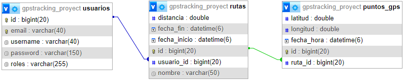

1. **Nombre del proyecto: Drives Tracker**
2. Idea del proyecto

Este proyecto consiste en la creación de una **API REST** segura, desarrollada con **Spring Boot** y usando **Spring Security**.
La idea principal es una App que permite almacenar y registrar el seguimiento en tiempo real de un vehículo usando el GPS de un dispositivo móvil.

3. Justificación del proyecto
Este proyecto nace para cubirar la necesidad de poder tener una App que resgistre tus salidas, rutas, viajes en vehiculos para poder consultarlas y compartirlas en cualquier momento. Nace con la idea principal de no tener la preocupación de no saber como encontrar o localizar de nuevo algún lugar o carretera por el cual has conducido.
Pensada principalmente para el público motero, que sale a hacer rutas a la aventura sin un destino concreto y quieren tener un registro de esta.

4. Descripciónn de las tablas 

# Endpoints
### Tabla usuarios
| Método | Endpoint       | Descripción                |
|--------|----------------|----------------------------|
| POST   | /usuarios      | Registrar nuevo usuario    |
| GET    | /usuarios      | Obtener todos los usuarios |
| GET    | /usuario/{id}  | Obtener usuario por ID     |
| PUT    | /usuarios/{id} | Actualizar usuario por ID  |
| DELETE | /usuarios/{id} | Eliminar usuario por ID    |

### Tabla rutas
| Método | Endpoint    | Descripción             |
|--------|-------------|-------------------------|
| POST   | /rutas      | Registrar nueva ruta    |
| GET    | /rutas      | Obtener todas las rutas |
| GET    | /rutas/{id} | Obtener ruta por ID     |
| PUT    | /rutas/{id} | Actualizar ruta por ID  |
| DELETE | /rutas/{id} | Eliminar ruta por ID    |

### Tabla puntos_gps
| Método | Endpoint           | Descripción                              |
|--------|--------------------|------------------------------------------|
| GET    | /rutas/{id}/puntos | Obtiene todos los puntos GPS de una ruta |
| POST   | /rutas/{id}/puntos | Añade una lista de puntos GPS a una ruta |

# Explicación Endpoints
### Tabla usuarios
- POST /usuarios -> Resgistra un nuevo usuario proporcionando un correo, contraseña y nombre de usuario. Responde con error si el usuario ya existe.
- GET /usuarios -> Obtiene un listado de la información de todos los usuarios.
- GET /usuarios/{id} -> Obtiene la información de un usuario por su ID. Solo puede acceder si el rol es **ADMIN** o el propio usuario.
- PUT /usuarios/{id} -> Actualiza la información de un usuario
- DELETE /usuarios/{id} -> Borra un usuario a través de su ID y todas sus rutas asociadas. Responde con error si el usuario no existe.

### Tabla rutas
- POST /rutas -> Registra una nueva ruta asociada al usuario autenticado. ...
- GET /rutas -> Obtiene un listado de todas las rutas creadas por un usuario
- GET /rutas/{id} -> Obtiene los detalles de una ruta específica mediante su ID.
- PUT /rutas/{id} -> Permite actualizar la información de una ruta, como el nombre
- DELETE /rutas/{id} -> Elimina una ruta mediante su ID, del usuario autenticado.
- 
### Tabla puntos_gps
- POST /rutas/{id}/puntos -> Permite añadir un listado de puntos GPS a una ruta existente.
- GET /rutas/{id}/puntos -> Obtiene todos los puntos asociados a una ruta específica por su ID.

# Diagrama E-R 
